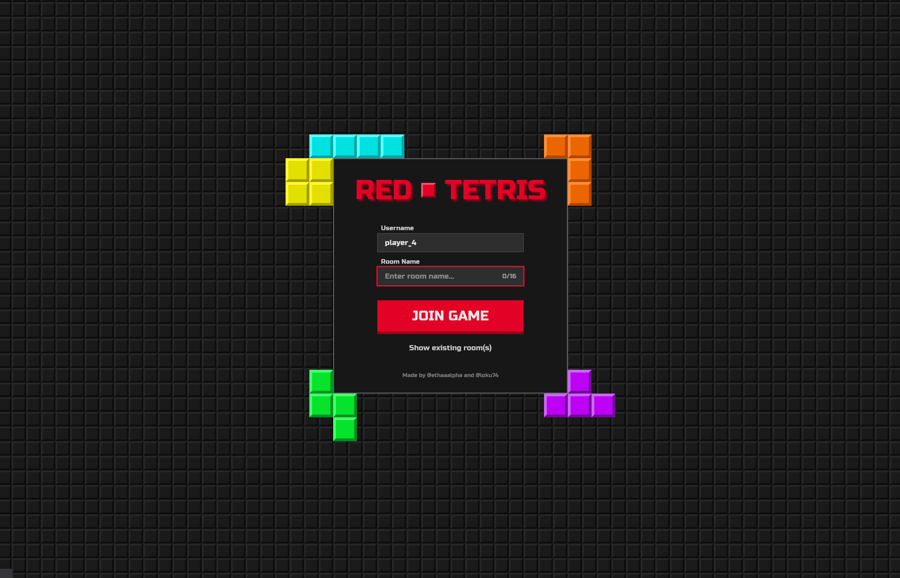
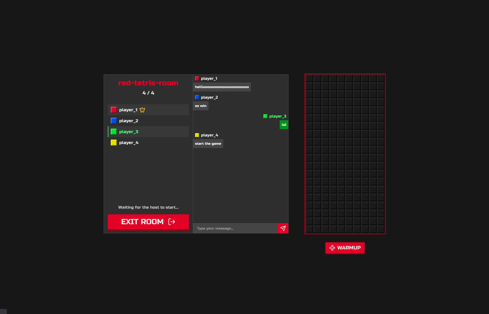
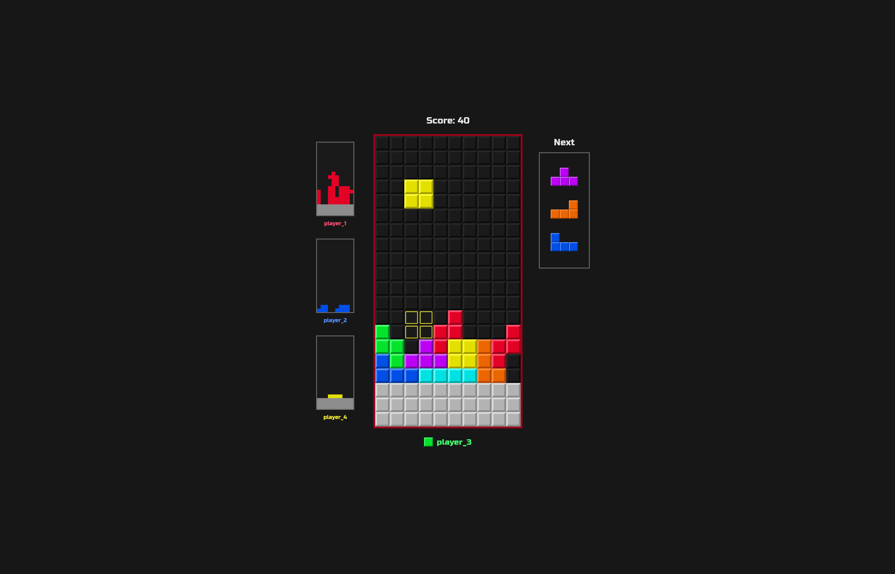
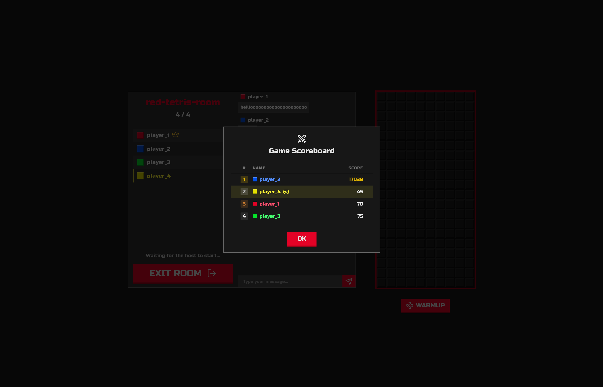

# Red Tetris

A real-time multiplayer Tetris game developed as part of the 42 School curriculum.

## Overview

Red Tetris is a full-stack web application that allows users to play Tetris against each other in real-time. Players can join rooms, chat, spectate, and compete. The project is designed using a modern monorepo structure.

## Features

- **Multiplayer Rooms:** Create or join rooms with up to 4 players.
- **Real-Time Gameplay:** Smooth, responsive game synchronization using WebSockets.
- **Spectator Mode:** Watch games in progress.
- **In-Game Chat:** Communicate with other players in your room.
- **Host Controls:** Kick players, start matches, and configure room settings.

## Tech Stack

The project is managed as a **Bun Workspace** monorepo with the following components:

- **Client:**
  - [Svelte 5](https://svelte.dev/) & [SvelteKit](https://kit.svelte.dev/)
  - [Vite](https://vitejs.dev/)
  - [Tailwind CSS v4](https://tailwindcss.com/)
  - [TypeScript](https://www.typescriptlang.org/)
  - [Socket.io Client](https://socket.io/)

- **Server:**
  - [Bun](https://bun.sh/)
  - [Express](https://expressjs.com/)
  - [Socket.io](https://socket.io/) (with `@socket.io/bun-engine`)
  - [Zod](https://zod.dev/) for schema validation
  - [Vitest](https://vitest.dev/) for testing

- **Shared:**
  - Common types, game logic, and constants shared between client and server.

## Getting Started

### Prerequisites

- [Bun](https://bun.sh/) (v1.3+ recommended)
- [Docker](https://www.docker.com/) (optional, for deployment)

### Local Development

1. **Clone the repository:**
   ```bash
   git clone <your-repo-url>
   cd red-tetris
   ```

2. **Install dependencies:**
   From the root of the project, run:
   ```bash
   bun install
   ```

3. **Run the Server:**
   Start the backend:
   ```bash
   bun run server
   ```

4. **Run the Client:**
   In a separate terminal, start the SvelteKit development server:
   ```bash
   cd client
   bun run dev
   ```

### Docker Deployment

A `Dockerfile` and a `cli.sh` script are provided for easy production deployments. The Docker setup builds both the frontend (as a static site) and backend, serving everything from the Express server.

1. **Build the image:**
   ```bash
   bash cli.sh build
   ```
   *(Note: Use `bash cli.sh build-linux` if you specifically need to cross-compile for the linux/amd64 platform).*

2. **Run the container:**
   ```bash
   bash cli.sh run
   ```
   This will start the server and bind it to port 3000.

## Project Structure

```text
red-tetris/
├── client/           # SvelteKit frontend application
├── server/           # Bun + Express + Socket.io backend
├── shared/           # Shared TypeScript interfaces and game constants
├── Dockerfile        # Production multi-stage Dockerfile
├── cli.sh            # Helper script for Docker build/run
├── package.json      # Root workspace configuration
└── bun.lock          # Bun lockfile
```

## Screenshots

| Home | Lobby |
|:---:|:---:|
|  |  |

| Game | Scoreboard |
|:---:|:---:|
|  |  |
